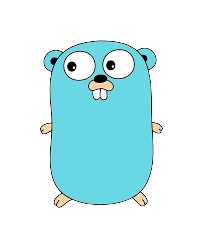
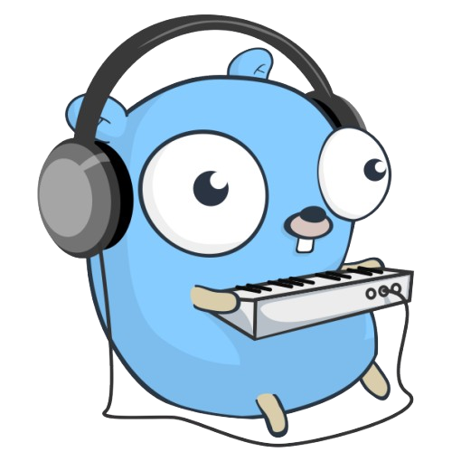
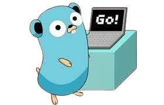
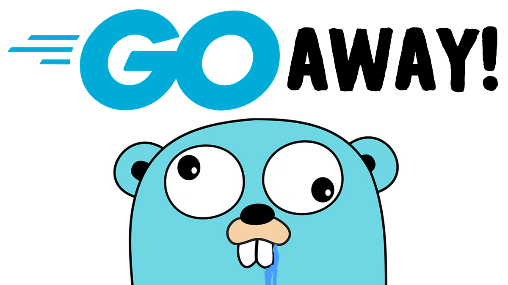

# Repo fo pushing golang tasks
---
## Day-1                       

- [x] Calculator  
- [x] Odd or Even  
- [x] Fibonacci

## DAY-2

- [x] Function that returns sum, diff, product, and quotient of two numbers.
- [x] Division with error handling (handle divide by zero).
- [x] Create a custom package for arithmetic functions.

## DAY-3

- [x] Find max and min in an array.
- [x] Remove duplicates from a slice.
- [x] Create a map for student names & grades, allow updates.

## DAY-4

- [ ] Create Person struct with a print method.
- [ ] Implement Shape interface with Area() and Perimeter() for Circle and Rectangle.
- [ ] Function to modify an integer using pointers.

 ## DAY-5
 

 - [ ] Two goroutines printing odd & even numbers concurrently.
 - [ ] Producer-consumer system using channels.
 - [ ] Use Mutex to avoid race in counter.

***
***
***

