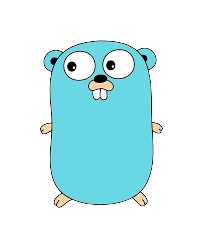
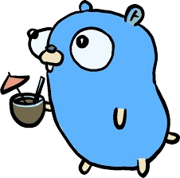

# GOLANG TASK...
----
## Day-1                       

- [x] Calculator  
- [x] Odd or Even  
- [x] Fibonacci

## DAY-2

- [x] Function that returns sum, diff, product, and quotient of two numbers.
- [x] Division with error handling (handle divide by zero).
- [x] Create a custom package for arithmetic functions.

## DAY-3

- [x] Find max and min in an array.
- [x] Remove duplicates from a slice.
- [x] Create a map for student names & grades, allow updates.

## DAY-4

- [x] Create Person struct with a print method.
- [x] Implement Shape interface with Area() and Perimeter() for Circle and Rectangle.
- [x] Function to modify an integer using pointers.

 ## DAY-5

 - [x] Two goroutines printing odd & even numbers concurrently.
 - [x] Producer-consumer system using channels.
 - [x] Use Mutex to avoid race in counter.

***
***
***

## PROJECT CRUD-APP

### Features

- Struct: `Student` (Name, Age)
- Slice to store students
- Functions:
    - `AddStudent(name string, age int)`
    - `ListStudents()`
    - `UpdateStudent(index int, newName string, newAge int)`
    - `DeleteStudent(index int)`
- Menu loop for CRUD actions
- Error handling & pointer usage

